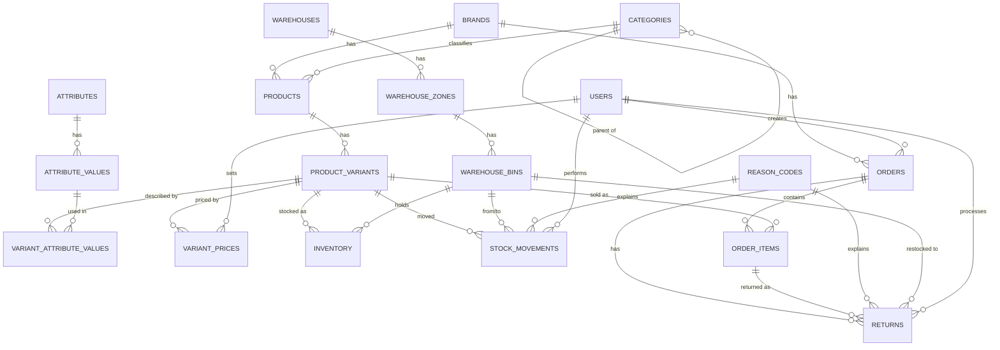

# ER Diagram — Multi-Brand Inventory & Order Management System

## Entity Relationships (textual)

- **brands** (1) ── (many) **products**
- **categories** (1) ── (many) **products**
- **categories** (1) ── (many) **categories** *(optional self-reference for subcategories)*
- **products** (1) ── (many) **product_variants**
- **attributes** (1) ── (many) **attribute_values**
- **product_variants** (many) ── (many) **attribute_values** via **variant_attribute_values**
- **product_variants** (1) ── (many) **variant_prices** *(price history; only one row per variant has `effective_to IS NULL`)*
- **users** (1) ── (many) **variant_prices** *(who set the price)*
- **warehouses** (1) ── (many) **warehouse_zones**
- **warehouse_zones** (1) ── (many) **warehouse_bins**
- **product_variants** (many) ── (many) **warehouse_bins** via **inventory** *(quantity on hand per variant per bin)*
- **product_variants** (1) ── (many) **stock_movements**
- **warehouse_bins** (1) ── (many) **stock_movements** *(as `from_bin_id` or `to_bin_id`)*
- **reason_codes** (1) ── (many) **stock_movements**
- **users** (1) ── (many) **stock_movements** *(`performed_by`)*
- **brands** (1) ── (many) **orders**
- **users** (1) ── (many) **orders** *(`created_by`)*
- **orders** (1) ── (many) **order_items**
- **product_variants** (1) ── (many) **order_items**
- **orders** (1) ── (many) **returns**
- **order_items** (1) ── (many) **returns**
- **reason_codes** (1) ── (many) **returns**
- **warehouse_bins** (1) ── (many) **returns** *(`restock_bin_id`, when disposition = restock)*
- **users** (1) ── (many) **returns** *(`processed_by`)*

## Mermaid ER Diagram

## Notes

- **Brand isolation**: every `products` row carries a `brand_id`. All downstream tables (variants, inventory, movements, orders) inherit brand scope transitively through `product_id` / `variant_id` — no need to duplicate `brand_id` everywhere, and cross-brand reports simply `JOIN` back to `brands`.
- **Shared warehouse**: `warehouses` / `warehouse_zones` / `warehouse_bins` have no `brand_id` — both brands' stock lives in the same physical bins, differentiated only by which variant (and therefore which brand) occupies them.
- **SKU/QR**: `product_variants.sku` is generated at the application layer from `brand.code` + `category.code` + a sequence + the variant's attribute codes (e.g., `ALH-HIJ-0007-BLK-M-CHF`). `qr_code_value` defaults to the same string and is what gets encoded into the printed QR sticker — one per variant, applied to every physical unit of that variant.
- **Stock movement types**: `inbound` (nothing → bin), `outbound` (bin → nothing, tied to an order), `transfer` (bin → bin), `return_in` (nothing → bin, tied to a return), `adjustment` (manual correction, e.g. after a physical count). The `chk_movement_bins` constraint enforces which of `from_bin_id`/`to_bin_id` must be set per type.
- **Pricing history**: `variant_prices` never updates in place — a price change inserts a new row and closes out the previous one (`effective_to = now()`). `order_items.unit_price_at_sale` snapshots the price at the moment of sale, so historical orders are immune to later price changes.
